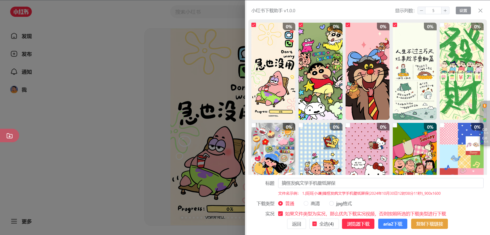
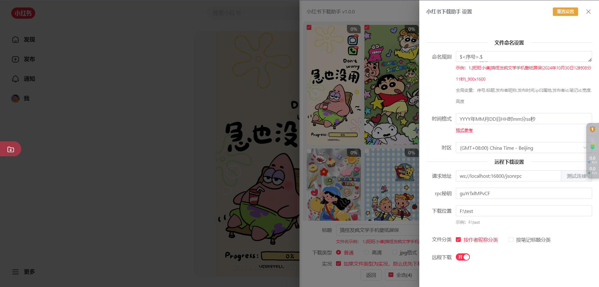

# 小红书下载脚本

> 注意注意：
>
> 该脚本仅供学习交流使用
>
> 尊重版权：请各位在使用的过程中，尊重他人劳动成果。
>
> 切勿滥用：大批量数据下载有封号风险，若违规大批量下载导致账号被封，与脚本无关。

## 简介

小红书下载脚本帮助你一键下载你喜欢的图片、视频、实况。

功能：

1. 支持下载图片、视频、实况
2. 支持浏览器下载、aria2远程下载
3. 支持自定义下载位置，支持按文件夹分类(按作者昵称、按笔记标题分类)
4. 支持选择下载(可选择一篇笔记中的部分图片)
5. 支持自定义文件名格式
6. 支持复制下载链接

## 预览





## 使用方法

安装脚本之后，屏幕左边会出现一个浮动按钮
点击浮动按钮，会弹出下载界面
选择需要下载的图片，点击下载按钮即可

## 常见问题

### 安装脚本后不显示浮动下载按钮

1. 看下油猴脚本有没有开启开发者模式，请参考 <https://www.tampermonkey.net/faq.php?version=5.3.2&ext=dhdg#Q209。>
2. 看下你的浏览器版本：升级到最新就好
3. 看下网络问题，由于有的代码需要依赖于`jsdelivr`提供的`cdn`服务，请检查能否正常访问【[点击测试](https://www.itdog.cn/ping/www.jsdelivr.com)】。如不能访问，建议稍后重试或切换网络。

### 远程下载连接失败

1. 请检查`服务地址`和`秘钥`是否正确。远程下载地址是`ws://`开头的，请填写完整
2. 检查`motrix`是否启动，`rpc`下载是否开启

提示：用`ws协议`体验会更好，可以及时接受到下载成功的通知。所以每次进入小红书都会重新连接。

## 脚本设置

提示：点击按钮`重置设置`可恢复为默认设置

文件命名规则配置：

1. 请勿使用特殊字符，特殊字符请参考 <https://blog.csdn.net/w8y56f/article/details/121189351>

2. 全局变量

   - 请将变量放到`<>`里，如`<ip归属地>`

   - 下载的时候，所定义规则中的变量会被替换

   - 如当匹配到`ip归属地`的时候会被替换为笔记中的ip地址

3. 变量组

   - 序号和图片尺寸会进行特殊处理，请把序号内容和图片尺寸放置到$$里

     - 特殊情况：当只下载一张图片时，序号内容会被去除
     - 只有选择高清图片，图片尺寸才会被包含到文件名中

     序号可以放置到任何位置，但是需要使用$$包裹。如下：

     ```
     // 示例1
     $<序号>.$
     [<发布者昵称>]
     <标题>
     (<发布时间>)
     $_<宽度>x<高度>$
     
     // 示例2
     [<发布者昵称>]
     <标题>
     (<发布时间>)
     $_<宽度>x<高度>$
     $_<序号>$
     ```

4. 时间格式

   该格式定义的是笔记发布时间的格式。可以自定义为任意内容（特殊字符会被浏览器替换为其他字符）

   - 如：`YYYY年MM月DD日HH时mm分ss秒`==>`2024年12月28日12时02分01秒`
   - 如：`YYYY年MM月`==>`2024年12月`

远程下载相关：

1. **下载位置**：如不填写可能会导致无法下载，请参照示例填写即可
2. **请求地址**：用的是ws协议，请填写完整
3. **文件分类**：文件分类仅对远程下载生效，可选择按作者或按标题进行分类

## 远程下载

推荐使用：<https://motrix.app/zh-CN/>

## 基本原理

hook XMLHttpRequest，提取响应数据，进行解析展示。
